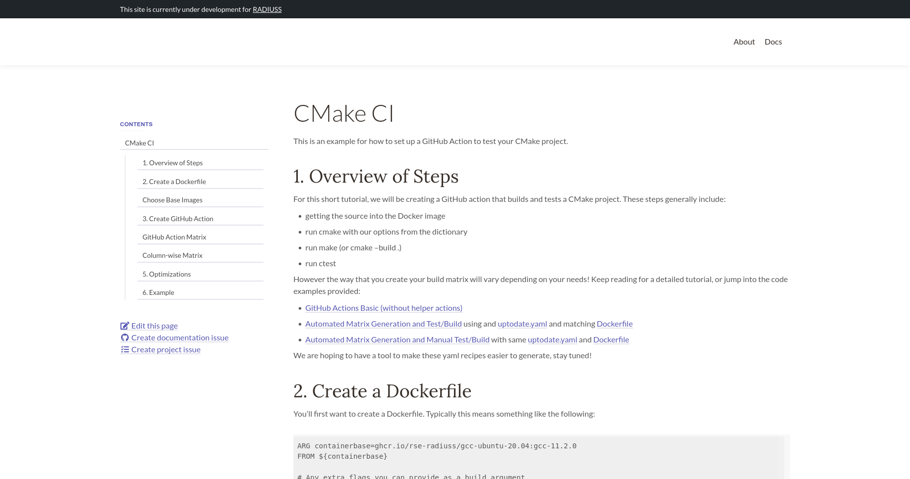

# RADIUSS Docs Jekyll


This is a RADIUSS documentation Jekyll theme that can be easily deployed to a RADIUSS
site. The style looks like this, either with a sidebar:



or without.


## Usage

Using the theme is easy - just add it as a `remote_theme` to your config yaml.

```bash
# Theme for docs
plugins:
  - jekyll-remote-theme

remote_theme: rse-radiuss/radiuss-docs-jekyll
```

And add 

```
gem "jekyll-remote-theme"
```

to your Gemfile.

### Add a Page

And then you can add any pages with the following front end matter (header)
to use the documentation template.

```
---
title: CMake
layout: docs
permalink: /cmake/
---
```

### Add a Sidebar

To add a sidebar to your pages, create a file under `_data/menus/` that is named
according to your sidebar, e.g., `_data/menus/mysidebar.yaml` for a sidebar named `mysidebar`.
The file should be a flat list of names and urls:

```yaml
- title: My Page
  url: "mypage"
- title: Root of Site
  url: ""
```

And then you can add this to the front end matter of pages where you want it to appear:

```
---
title: CMake
layout: docs
sidebar: mysidebar
permalink: /pagename/
---
```

## Development

If you want to use the gem, it is built during CI, and release is currently done from the command line:

```bash
$ /bin/bash script/release.sh
```

But this isn't required since we can use `jekyll-remote-theme` and use it directly from GitHub.
If you do release, you should bump the version in [radiuss-docs-jekyll.gemspec](radiuss-docs-jekyll.gemspec)
and be on the main branch.

License
-------

Copyright (c) 2021, Lawrence Livermore National Security, LLC. 
Produced at the Lawrence Livermore National Laboratory.

RADIUSS is licensed under the MIT license [LICENSE](./LICENSE).

Copyrights and patents in the RADIUSS Docker project are retained by
contributors. No copyright assignment is required to contribute to RADIUSS
Docker.

This work was produced under the auspices of the U.S. Department of
Energy by Lawrence Livermore National Laboratory under Contract
DE-AC52-07NA27344.
